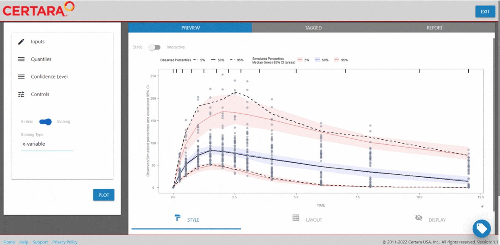

# tidyvpc <a href='https://github.com/certara/tidyvpc/'></a>

[](https://github.com/certara/tidyvpc)
[](https://cran.r-project.org/package=tidyvpc)
[](https://cran.r-project.org/package=tidyvpc)
[](https://cran.r-project.org/package=tidyvpc)
[](https://app.codecov.io/gh/certara/tidyvpc?branch=master)
[](https://certara.github.io/R-Certara/index.html)

### Overview

`tidyvpc` provides a flexible and comprehensive toolkit for parameterizing a Visual Predictive Check (VPC) in R.  With `tidyverse` style syntax, you can chain together functions (e.g., `%>%` or `|>`) to easily perform stratification, censoring, prediction correction, and more. `tidyvpc` supports both continuous and categorical VPC.

[Learn More](https://certara.github.io/tidyvpc/articles/tidyvpc_whats_new.html)

### Installation and Running information

```r
# CRAN
install.packages("tidyvpc")

# Development
# If there are errors (converted from warning) during installation related to packages
# built under different version of R, they can be ignored by setting the environment variable 
# R_REMOTES_NO_ERRORS_FROM_WARNINGS="true" before calling remotes::install_github()

Sys.setenv(R_REMOTES_NO_ERRORS_FROM_WARNINGS="true")
remotes::install_github("certara/tidyvpc")
```

### Learning `tidyvpc`

The [`Certara.VPCResults`](https://certara.github.io/R-VPCResults/) package offers a Shiny app that can be used to easily generate the underlying `tidyvpc` and `ggplot2` code used to create your VPC. 

After importing the observed and simulated data into your R environment, use the function [`vpcResultsUI()`](https://certara.github.io/R-VPCResults/reference/vpcResultsUI.html) to parameterize the VPC and customize the resulting plot output using the Shiny GUI - then generate the R code to reproduce from command line!

```r
install.packages("Certara.VPCResults",
                 repos = c("https://certara.jfrog.io/artifactory/certara-cran-release-public/",
                           "https://cloud.r-project.org"),
                 method = "libcurl")
                 
library(tidyvpc)
library(Certara.VPCResults)

vpcResultsUI(observed = obs_data[MDV == 0], simulated = sim_data[MDV == 0])

```



The Shiny application can serve as a learning heuristic and ensures reproducibility by allowing you to save `R` and/or `Rmd` scripts. Additionally, you may render RMarkdown to an `html`, `pdf`, or `docx` output report. Click [here](https://certara.github.io/R-VPCResults/) to learn more about [`Certara.VPCResults`](https://certara.github.io/R-VPCResults/).


### Data Preprocessing
`tidyvpc` requires a specific structure of observed and simulated data in order to successfully generate VPC.

* DV cannot be missing in observed/simulated data i.e. subset `MDV == 0`
* Observed data must be ordered by: Subject-ID, IVAR (Time)
* Simulated data must be ordered by: Replicate, Subject-ID, IVAR (Time)

See `tidyvpc::obs_data` and `tidyvpc::sim_data` for example data structures.

### Usage

``` r
library(magrittr)
library(ggplot2)
library(tidyvpc)

# Filter MDV = 0
obs_data <- tidyvpc::obs_data[MDV == 0]
sim_data <- tidyvpc::sim_data[MDV == 0]

#Add LLOQ for each Study 
obs_data$LLOQ <- obs_data[, ifelse(STUDY == "Study A", 50, 25)]

# Binning Method on x-variable (NTIME)
vpc <- observed(obs_data, x=TIME, y=DV) %>%
    simulated(sim_data, y=DV) %>%
    censoring(blq=(DV < LLOQ), lloq=LLOQ) %>%
    stratify(~ STUDY) %>%
    binning(bin = NTIME) %>%
    vpcstats()

```

Plot Code:

``` r
ggplot(vpc$stats, aes(x=xbin)) +
    facet_grid(~ STUDY) +
    geom_ribbon(aes(ymin=lo, ymax=hi, fill=qname, col=qname, group=qname), alpha=0.1, col=NA) +
    geom_line(aes(y=md, col=qname, group=qname)) +
    geom_line(aes(y=y, linetype=qname), size=1) +
    geom_hline(data=unique(obs_data[, .(STUDY, LLOQ)]),
        aes(yintercept=LLOQ), linetype="dotted", size=1) +
    geom_text(data=unique(obs_data[, .(STUDY, LLOQ)]),
        aes(x=10, y=LLOQ, label=paste("LLOQ", LLOQ, sep="="),), vjust=-1) +
    scale_colour_manual(
        name="Simulated Percentiles\nMedian (lines) 95% CI (areas)",
        breaks=c("q0.05", "q0.5", "q0.95"),
        values=c("red", "blue", "red"),
        labels=c("5%", "50%", "95%")) +
    scale_fill_manual(
        name="Simulated Percentiles\nMedian (lines) 95% CI (areas)",
        breaks=c("q0.05", "q0.5", "q0.95"),
        values=c("red", "blue", "red"),
        labels=c("5%", "50%", "95%")) +
    scale_linetype_manual(
        name="Observed Percentiles\n(black lines)",
        breaks=c("q0.05", "q0.5", "q0.95"),
        values=c("dotted", "solid", "dashed"),
        labels=c("5%", "50%", "95%")) +
    guides(
        fill=guide_legend(order=2),
        colour=guide_legend(order=2),
        linetype=guide_legend(order=1)) +
    theme(
        legend.position="top",
        legend.key.width=grid::unit(1, "cm")) +
    labs(x="Time (h)", y="Concentration (ng/mL)")
```


Or use the built-in `plot()` function from the `tidyvpc` package.

``` r
# Binless method using 10%, 50%, 90% quantiles and LOESS Prediction Corrected

# Add PRED variable to observed data from first replicate of sim_data
obs_data$PRED <- sim_data[REP == 1, PRED]

vpc <- observed(obs_data, x=TIME, y=DV) %>%
    simulated(sim_data, y=DV) %>%
    stratify(~ GENDER) %>%
    predcorrect(pred=PRED) %>%
    binless(loess.ypc = TRUE) %>%
    vpcstats(qpred = c(0.1, 0.5, 0.9))

plot(vpc)
```

